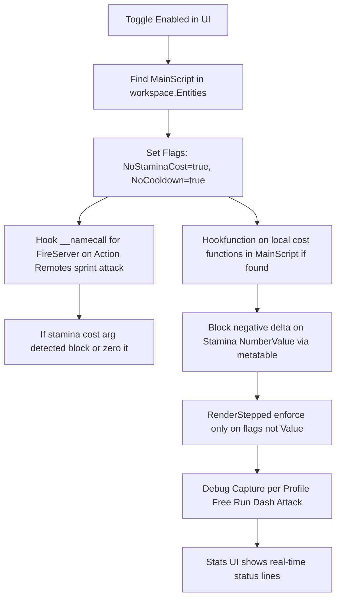

# Inf Stamina Redesign Plan

## Current Issues
- Current implementation restores Stamina.Value after change and sets NoStaminaCost=true.
- This is post-drain restoration which the user wants to avoid.
- Character still depletes (likely client-side animation or other stats like BodyFatigue/Exhaustion or unhooked remotes/functions).
- StaminaFeature does not implement the full API expected by stats.lua (GetDebugLines, GetStatusLines, debug profiles).
- Hooks (newindex, namecall) are incomplete or disabled due to errors.

## Missing Info (from user)
- Specific game/Place ID (to identify exact remotes in MainScript).
- Exact console DEBUG warns when sprint/attack drains stamina (to target specific RemoteEvents or local functions).
- Decompiled snippet of stamina subtraction logic in workspace.Entities.{Name}.MainScript.

## Proposed Architecture (Source Prevention - No Direct Value Hard-Set)

Note: Prevention at source by zeroing cost before subtraction happens. No post-set of Stamina = MaxStamina.

## Actionable Todo List
1. Add entity change listener to re-setup hooks when player respawns.
2. Improve hookRemotes to detect and block stamina-costing FireServer calls for sprint/attack (use getgenv flag to toggle block).
3. Fix and enable safe __newindex / __namecall with pcall to avoid script errors.
4. Implement full StaminaFeature API: IsDebugEnabled, SetDebugEnabled, GetDebugLines, GetStatusLines, debug profile switching, capture for Run/Dash/Attack.
5. Set additional flags (BodyFatigue=0, Exhaustion=0) if present in Stats.
6. Clean all temporary warn/debug prints; keep only when debug enabled.
7. Update integration in Fatality/main.lua only if new methods added.
8. Test with debug capture to identify which profile/action still leaks drain.
9. Ensure no changes to src/source.luau or ui files except if toggle needs update.

## Next Steps
- User provides real game name, console logs, or MainScript snippet for remote/function names.
- Approve or modify this plan.
- Switch to code mode to implement updated features/stamina.lua.

This keeps UI in ui/main.lua, logic isolated in features/stamina.lua per AGENTS.md rules.
